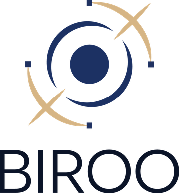
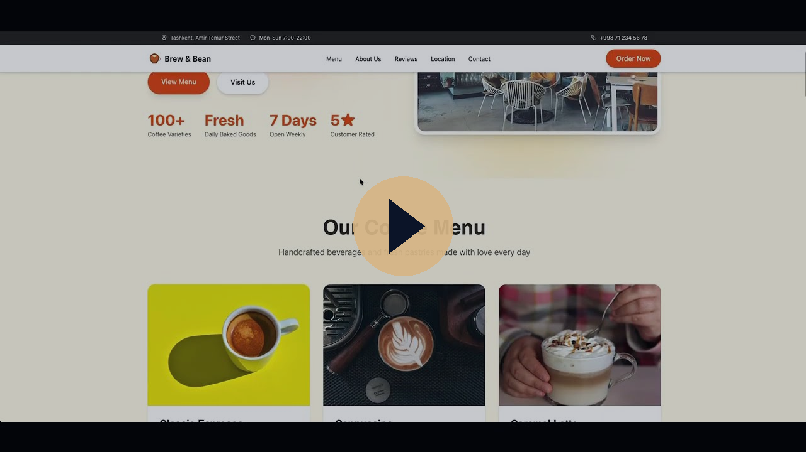
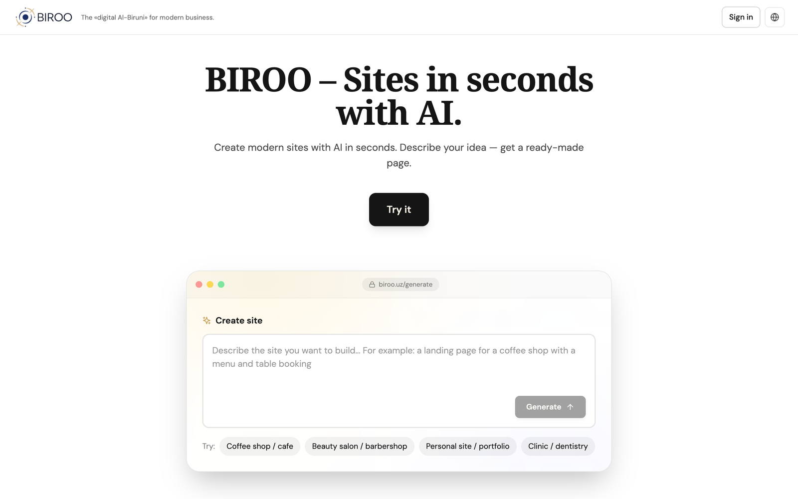
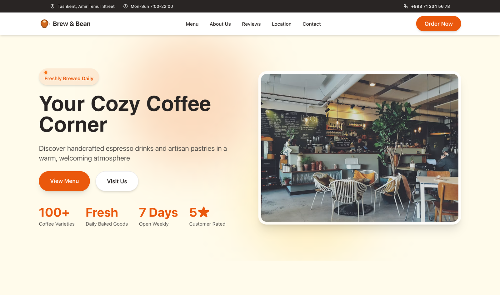

<div align="center">



# BIROO — Websites in seconds, with AI

**The "digital Al‑Biruni" for modern business.**
Describe your business in plain language — BIROO generates a complete, published website in under a minute.

[](https://biroo.uz)
[](https://youtu.be/7knKFDkMeFo)


**🌐 Live product: [biroo.uz](https://biroo.uz)  ·  ▶️ [Watch the demo](https://youtu.be/7knKFDkMeFo)**

<a href="https://youtu.be/7knKFDkMeFo">
  
</a>

</div>

> **About this repository.** This is a public **showcase** of BIROO — product overview, screenshots and architecture.
> BIROO's source code (the generation pipeline, prompts, templates and backend) is **proprietary and kept in a private repository**.
> Reviewers who need source access can be added to the private repo on request — see [Access for reviewers](#access-for-reviewers).

---

## What is BIROO?

Most small businesses in Uzbekistan and Central Asia — cafes, salons, clinics, workshops — still have no website. Every existing path fails them: agencies are slow and expensive, DIY builders are complex and English‑first, and social media is not an owned, credible web presence.

**BIROO closes that gap.** The owner types what their business is, in their own language, and gets a real, published website — structure, copy, photos and design — in under a minute. No designer, no code.

<div align="center">

</div>

---

## How it works

```
Describe  →  AI generates  →  Edit in chat  →  Publish
```

1. **Describe** — the owner types their business in Uzbek, Russian or English.
2. **AI generates** — BIROO composes a full site: an architect model plans the sections, then each block gets content, relevant photography and a matching visual style.
3. **Edit in chat** — change text, swap photos, add or remove whole sections — all in plain language.
4. **Publish** — live instantly on a free `name.biroo.uz` subdomain, or the owner's own `.uz` domain.

Under the hood the generator runs a **block pipeline** — a large library of studio‑grade section templates is assembled by AI into a coherent page, so the output looks designed, not auto‑generated.

### A site built with BIROO (one prompt)

A live landing for a Tashkent coffee shop — adaptive layout, curated photography, a menu, location and lead forms. Generated, then refined in chat:

<div align="center">

</div>

*Live example: [coffee.biroo.uz](https://coffee.biroo.uz)*

---

## Highlights

- ⚡ **Idea → published site in under a minute** — no designer, no code
- 🗣️ **Conversational editing** — change anything by describing it
- 🎨 **100+ studio‑grade block templates** power generation for a designed look
- 🌍 **Local‑first** — Uzbek & Russian, `.uz` domains, local payment systems, local imagery
- 📱 **Responsive** output (360–1280px), light & dark aware
- 🚀 **One‑click publish** to a subdomain or a custom `.uz` domain

## Tech stack

| Layer | Stack |
|---|---|
| Frontend | React · TypeScript · Vite · Tailwind CSS |
| Backend | Python · FastAPI |
| Generation | Latest large language models + a curated template/block system |
| Media | Stock photography, relevance‑filtered per block |
| Infra | nginx · wildcard subdomains · automated `.uz` domain registration |
| Payments | Payme · Click (Uzbekistan) |

## Status

**MVP, live since May 2026.** The full loop — generate → edit in chat → publish on a real domain — works in production. Monetization (a usage‑credit system with Payme and Click) is built and ready to switch on.

---

## Access for reviewers

The full source lives in a **private** repository. To grant a reviewer read access, send your GitHub handle or email and we'll add you as a read‑only collaborator for the evaluation period.

## Team & contact

Built by **MCHJ «LIFESTYLE CREATIVE»** — a web & product studio in Tashkent, Uzbekistan, with 100+ production templates behind BIROO's AI.

- 🌐 [biroo.uz](https://biroo.uz)
- ✉️ support@biroo.uz

## License

© MCHJ «LIFESTYLE CREATIVE». All rights reserved. See [LICENSE](LICENSE).
This repository is a product showcase; it does not grant any rights to BIROO's software or trademarks.
